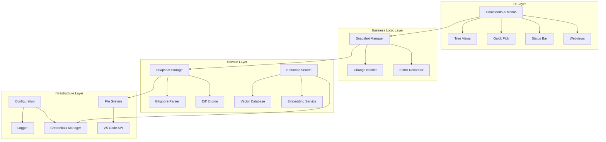

# CodeLapse - Developer Guide

Welcome to the CodeLapse developer documentation! This comprehensive guide will help you understand, contribute to, and extend the CodeLapse VS Code extension.

## Quick Start for Contributors

### Prerequisites

- **Node.js**: Version 16.x or higher (check `engines` in `package.json`)
- **npm**: Version 8.x or higher
- **VS Code**: Version 1.75.0 or higher
- **Git**: For version control and contribution workflow

### Development Setup

1. **Clone and Install**
   ```bash
   git clone https://github.com/YukioTheSage/code-snapshots.git
   cd code-snapshots
   npm install
   ```

2. **Open in VS Code**
   ```bash
   code .
   ```

3. **Start Development**
   - Press `F5` to launch Extension Development Host
   - Make changes in `src/` directory
   - Use `Ctrl+R` in Extension Development Host to reload changes
   - Use `Ctrl+Shift+I` to open Developer Tools for debugging

### Build and Test

```bash
# Type checking
npm run check-types

# Build for development
npm run compile

# Build for production
npm run esbuild-prod

# Watch mode (recommended for development)
npm run watch

# Linting
npm run lint
npm run lint:fix

# Formatting
npm run format

# Package extension
npm run package
```

## Architecture Overview

CodeLapse follows a **layered, event-driven architecture** with clear separation of concerns:



### Core Design Principles

1. **Separation of Concerns**: UI, business logic, and data access are clearly separated
2. **Event-Driven**: Components communicate through events to maintain loose coupling
3. **Asynchronous Operations**: All I/O operations are non-blocking
4. **Extensibility**: Plugin architecture allows for easy feature additions
5. **Security First**: Sensitive data is handled through secure storage mechanisms

## Detailed Architecture

### Core Components

#### 1. Extension Entry Point (`extension.ts`)
**Responsibility**: Bootstrap and lifecycle management

```typescript
// Key initialization pattern
export async function activate(context: vscode.ExtensionContext) {
    // 1. Initialize core services
    const snapshotStorage = new SnapshotStorage(context);
    const snapshotManager = new SnapshotManager(snapshotStorage, gitApi);
    
    // 2. Register UI components
    const treeView = new SnapshotTreeView(snapshotManager);
    
    // 3. Register commands
    registerCommands(context, snapshotManager, treeView);
    
    // 4. Setup event listeners
    setupEventHandlers(snapshotManager, treeView);
}
```

#### 2. Snapshot Manager (`snapshotManager.ts`)
**Responsibility**: Core business logic for snapshot operations

**Key Methods**:
- `takeSnapshot(options?)`: Creates new snapshots with optional context
- `applySnapshotRestore(snapshotId)`: Restores workspace to snapshot state
- `calculateRestoreChanges(snapshotId)`: Previews changes before restore
- `deleteSnapshot(snapshotId)`: Removes snapshots and cleanup

**Event System**:
```typescript
// Emits events for UI updates
onDidChangeSnapshots: vscode.Event<void>
```

#### 3. Snapshot Storage (`snapshotStorage.ts`)
**Responsibility**: Data persistence and file system operations

**Storage Strategy**:
- **Differential Storage**: Only changes are stored after first version
- **Content Caching**: In-memory cache for resolved file content
- **Binary Detection**: Automatic detection and handling of binary files
- **Recovery Mechanisms**: Automatic recovery from corrupted indexes

#### 4. UI Components

**Tree View** (`ui/treeView.ts`):
- Implements `vscode.TreeDataProvider`
- Supports filtering by date, tags, favorites, and files
- Provides context menus and inline actions

**Quick Pick** (`ui/quickPick.ts`):
- Snapshot selection interface
- Enhanced metadata display
- Keyboard navigation support

**Status Bar** (`statusBarController.ts`):
- Real-time snapshot status
- Click-to-action functionality
- Progress indicators

### Service Layer

#### Semantic Search Services (Experimental)
> ⚠️ **EXPERIMENTAL**: These services are under active development

- **Code Chunker** (`services/codeChunker.ts`): Language-aware code splitting
- **Vector Database** (`services/vectorDatabaseService.ts`): Pinecone integration
- **Embedding Service** (`services/embeddingService.ts`): Gemini API integration
- **Search Orchestration** (`services/semanticSearchService.ts`): Query processing

#### Security Services
- **Credentials Manager** (`services/credentialsManager.ts`): Secure API key storage
- Uses VS Code's `SecretStorage` API
- Never stores sensitive data in plaintext

### Data Models

#### Snapshot Structure
```typescript
interface Snapshot {
    id: string;                    // Unique identifier
    timestamp: number;             // Creation time
    description?: string;          // User description
    gitBranch?: string;           // Git context
    gitCommitHash?: string;       // Git context
    tags?: string[];              // User tags
    notes?: string;               // Extended notes
    taskReference?: string;       // External task reference
    isFavorite?: boolean;         // User favorite flag
    isSelective?: boolean;        // Partial snapshot flag
    selectedFiles?: string[];     // Files in selective snapshot
    files: { [path: string]: FileData };
}

interface FileData {
    content?: string;             // Full content (first occurrence)
    diff?: string;               // Diff from base
    baseSnapshotId?: string;     // Reference to base snapshot
    deleted?: boolean;           // Deletion marker
    isBinary?: boolean;          // Binary file marker
}
```

#### Storage Format
```
.snapshots/
├── index.json              # Master index
├── snapshot-{timestamp}-{hash}/
│   └── snapshot.json       # Full snapshot data
└── ...
```

## Data Storage

### Snapshot Format

Snapshots are stored in the `.snapshots` directory (configurable via `vscode-snapshots.snapshotLocation`) with the following structure:

```
.snapshots/
  ├── index.json              # Master index of all snapshots (IDs, timestamps, descriptions, currentIndex)
  ├── snapshot-1617289464-abc/
  │   └── snapshot.json       # Full metadata and file data for this snapshot
  ├── snapshot-1617289500-def/
  │   └── snapshot.json
  └── ...
```


The `index.json` file contains a summary for quick loading:

```json
{
  "snapshots": [
    // Array of basic info for each snapshot
    {
      "id": "snapshot-1617289464-abc",
      "timestamp": 1617289464000,
      "description": "Initial setup"
    }
    // ... more snapshot summaries
  ],
  "currentIndex": 1 // Index in the 'snapshots' array of the currently restored snapshot (-1 if none)
}
```

Each individual `snapshot.json` file contains the full snapshot details:

```json
{
  "id": "snapshot-1617289500-def",
  "timestamp": 1617289500000,
  "description": "Added login feature",
  "gitBranch": "feature/login", // Optional Git info
  "gitCommitHash": "a1b2c3d4", // Optional Git info
  "tags": ["feature", "login"], // Optional context
  "notes": "Implemented basic email/password login.", // Optional context
  "taskReference": "JIRA-123", // Optional context
  "isFavorite": true, // Optional context
  "isSelective": false, // Indicates if only specific files were included
  "selectedFiles": [], // List of relative paths if isSelective is true
  "files": {
    // File data
    "src/index.js": {
      // Full content for the first time or if base couldn't be resolved
      "content": "console.log('Hello!');"
    },
    "src/utils.js": {
      // Diff patch if changed from base
      "diff": "@@ -1,1 +1,1 @@\n-console.log('Old');\n+console.log('New!');",
      // Reference to the previous snapshot where this file existed
      "baseSnapshotId": "snapshot-1617289464-abc"
    },
    "src/unchanged.js": {
      // No diff or content means it's unchanged from base
      "baseSnapshotId": "snapshot-1617289464-abc"
    },
    "src/deleted.js": {
      // Marker indicating the file was deleted in this snapshot
      "deleted": true
    },
    "images/logo.png": {
      // Marker indicating a binary file (no content/diff stored)
      "isBinary": true,
      "baseSnapshotId": "snapshot-1617289464-abc" // Still tracks existence relative to base
    }
  }
}
```

### Storage Optimization & Caching

The extension uses several techniques to manage storage and performance:

- **Differential Storage**: Only changes (diffs) are stored after the first version of a file, reducing disk usage.
- **Base Snapshot Reference**: Each file change points to the previous snapshot (`baseSnapshotId`) containing the file, allowing reconstruction.
- **Binary File Exclusion**: Files identified as binary (by extension or content analysis) are tracked for existence but their content isn't stored.
- **Ignore File Handling**: `.gitignore` and `.snapshotignore` prevent unnecessary files from being included.
- **Asynchronous I/O**: All file system operations use `fs.promises` to avoid blocking the extension host.
- **Content Caching**: `SnapshotStorage` maintains an in-memory cache (`contentCache`) for resolved file content (`getSnapshotFileContent`). This avoids repeatedly applying diffs for the same file version, significantly speeding up operations like diff views and restores. The cache has a maximum size and uses a simple eviction strategy.

## Core Algorithms

### Snapshot Creation Algorithm (`SnapshotManager.takeSnapshot`)

1.  Generate unique ID and timestamp.
2.  Collect context options (description, tags, notes, etc.) from arguments.
3.  Fetch current Git branch/commit info (if API available and enabled).
4.  Create initial `Snapshot` object.
5.  Instantiate `GitignoreParser`.
6.  **Delegate File Discovery:** Call `vscode.workspace.findFiles` using exclude/negated globs from `GitignoreParser` to get a list of candidate `vscode.Uri`s.
7.  Apply selective filtering if `isSelective` is true, based on `selectedFiles`.
8.  Perform secondary binary content check on suspicious files using `SnapshotStorage.checkSuspiciousFilesForBinaryContent`.
9.  Build a `Set` of relative paths for files existing in the filtered workspace (`currentWorkspaceFiles`).
10. Identify the `baseSnapshot` (if any). Get its file list (`previousSnapshotFiles`).
11. **Iterate through filtered `finalFiles`:**
    - Get relative path.
    - Check if binary using `SnapshotStorage.isBinaryFile`. If yes, record `{ isBinary: true, baseSnapshotId }` and continue.
    - **Delegate Read:** Call `SnapshotStorage.readFileContent` for the current file content. If null, skip.
    - If `baseSnapshot` has this file:
      - **Delegate Base Content Retrieval:** Call `SnapshotStorage.getSnapshotFileContent` for `baseContent`.
      - If `baseContent` exists and differs from current content, calculate `diff` using `createDiff` utility and store `{ diff, baseSnapshotId }`.
      - If `baseContent` exists and is identical, store `{ baseSnapshotId }`.
      - If `baseContent` is null (error), store full `{ content }` as fallback.
    - Else (new file), store full `{ content }`.
12. **Detect Deletions:** Iterate through `previousSnapshotFiles`. If a file is not in `currentWorkspaceFiles`, mark it in the new snapshot as `{ deleted: true }`.
13. **Delegate Save:** Call `SnapshotStorage.saveSnapshotData` to write `snapshot.json`.
14. Add snapshot to in-memory list (`this.snapshots`) and update `currentSnapshotIndex`.
15. **Delegate Index Save:** Call `SnapshotStorage.saveSnapshotIndex`.
16. Enforce snapshot limit (calling `SnapshotStorage.deleteSnapshotData` if needed).
17. Emit `onDidChangeSnapshots` event.
18. Return the created `Snapshot` object.


### Snapshot Restoration Algorithm (`commands.ts` / `SnapshotManager.applySnapshotRestore`)

1.  **Trigger:** User selects "Restore" from Tree View context menu or Quick Pick. Command handler (`jumpToSnapshot`) in `commands.ts` is invoked.
2.  **Calculate Changes:** Command handler calls `SnapshotManager.calculateRestoreChanges` to get a list of added/modified/deleted files relative to the current workspace.
3.  **Show Preview UI:** Command handler displays the changes in a Quick Pick for user review. Files with unsaved changes are marked.
4.  **Confirmation:** User selects "Restore Snapshot" or "Cancel" from the preview.
5.  **Conflict Check:** If confirmed, command handler checks for unsaved changes (`isDirty`) in the affected files.
6.  **Conflict Resolution UI:** If conflicts exist, command handler shows a modal warning with options: "Restore (Overwrite Unsaved)", "Take Snapshot & Restore", "Cancel".
7.  **Preserve Editor State:** Command handler calls `preserveEditorViewStates`.
8.  **Execute Core Restore:** If proceeding, command handler calls `SnapshotManager.applySnapshotRestore(snapshotId)`.
9.  **`applySnapshotRestore` Logic:**
    - Finds the target `snapshot`.
    - Gets current workspace files (using ignore logic).
    - Creates `expectedSnapshotFiles` map from the target snapshot.
    - **Handle Deletions:** Iterates through `currentWorkspaceFilesRelative`. If a file is not in `expectedSnapshotFiles` or marked `deleted` (and is not binary), calls `SnapshotStorage.deleteWorkspaceFile`.
    - **Handle Restorations/Additions:** Iterates through `expectedSnapshotFiles`. If not `deleted` and not `isBinary`:
      - **Delegate Content Retrieval:** Calls `SnapshotStorage.getSnapshotFileContent` (which handles diff resolution and caching).
      - If content is retrieved successfully, calls `SnapshotStorage.writeFileContent`.
    - Waits for all async file operations (`Promise.all`).
    - Updates `currentSnapshotIndex` and calls `SnapshotStorage.saveSnapshotIndex`.
    - Emits `onDidChangeSnapshots`.
    - Returns `true` on success.
10. **Restore Editor State:** Command handler calls `restoreEditorViewStates`.
11. **Show Progress/Completion UI:** Command handler manages `vscode.window.withProgress` and shows final success/error messages.


### File Content Resolution (`SnapshotStorage.getSnapshotFileContent`)

1.  Check cache using `snapshotId::relativePath` key. If hit, return cached value.
2.  Find the requested `snapshot` object in the `allSnapshots` list.
3.  Get the `fileData` for the `relativePath`. Return `null` if file/snapshot not found or `fileData.deleted` is true.
4.  If `fileData.content` exists (string), cache and return it.
5.  If `fileData.baseSnapshotId` exists:
    - Recursively call `getSnapshotFileContent` for the `baseSnapshotId`.
    - If base content is null (error in recursion), return `null`.
    - If `fileData.diff` exists, apply it to the base content using `applyDiff` utility. Cache and return the result (or `null` if patching fails).
    - If `fileData.diff` does _not_ exist, the file is unchanged from base. Cache and return the base content.
6.  If none of the above conditions match (e.g., `content` is explicitly `null` with no `baseSnapshotId`), cache and return `null`.
7.  Update cache before returning. Implement cache eviction if size limit exceeded.


### File Exclusion Logic (`GitignoreParser`, `SnapshotManager.takeSnapshot`)

1.  `GitignoreParser` reads `.snapshotignore` (priority) or `.gitignore`.
2.  Adds default patterns (`.snapshots/`, `node_modules/`, `.git/`, `venv/`, `.venv/`).
3.  Separates patterns into positive (`patterns`) and negated (`negatedPatterns`).
4.  `getExcludeGlobPattern()` converts positive patterns into a single `{...}` glob string for `findFiles`'s `exclude` parameter. Handles basic gitignore syntax nuances (leading/trailing `/`, no `/`).
5.  `getNegatedGlobs()` converts negated patterns into an array of glob strings.
6.  `SnapshotManager.takeSnapshot`:
    - Calls `getExcludeGlobPattern()` for the `exclude` argument in the first `vscode.workspace.findFiles('**/*', excludePattern)`.
    - Calls `getNegatedGlobs()`. For each negated glob, calls `vscode.workspace.findFiles(negatedGlob, null)` to find files that should be re-included.
    - Merges the results, ensuring uniqueness, to get the final list of files to snapshot.

## Error Handling

The extension implements several error handling strategies:

1.  **User Feedback**:

    - Shows clear error/warning/info messages via `vscode.window.showXMessage`.
    - Uses modal dialogs (`showWarningMessage` with `{ modal: true }`) for critical confirmations (delete, restore overwrite).
    - Provides guidance on how to resolve common issues.
    - Logs detailed information to the Output panel via the `logger` module.

2.  **Snapshot Consistency**:

    - `SnapshotStorage.loadSnapshotIndexAndMetadata` handles missing/corrupt `index.json` by attempting recovery from `snapshot.json` files (`recoverSnapshotsFromFileSystem`).
    - Validates snapshot IDs and `currentIndex` after loading/recovery.
    - File operations are atomic where possible (though full atomicity isn't guaranteed across multiple files).

3.  **Conflict Resolution**:

    - `commands.ts` checks for unsaved changes (`document.isDirty`) before snapshot restoration.
    - Prompts user with options ("Overwrite", "Take Snapshot & Restore", "Cancel") if conflicts are detected.
    - Confirms destructive operations (like snapshot deletion) using modal dialogs.

4.  **Asynchronous Operations**: Uses `try...catch` blocks extensively around `await` calls for file I/O and other potentially failing async operations. Logs errors gracefully without crashing the extension where possible.

## Performance Considerations

1.  **File Handling**:

    - **Async I/O**: All file system operations use `fs.promises`, preventing UI blocking.
    - **Optimized Filtering**: `vscode.workspace.findFiles` with glob patterns is used for efficient file discovery, leveraging VS Code's native capabilities. Manual iteration is minimized.
    - **Binary File Handling**: Binary files are detected early (extension, content sampling) and their content is not read/stored, saving I/O and memory.
    - **Differential Storage**: Reduces the amount of data written to disk for subsequent snapshots.

2.  **Memory Usage**:

    - **On-Demand Loading**: Full snapshot data (`snapshot.json`) is loaded only when needed (e.g., when expanding a node in the tree or resolving content). The initial load uses only the lightweight `index.json`.
    - **Content Caching**: `SnapshotStorage.getSnapshotFileContent` caches resolved content, avoiding redundant diff application and significantly improving performance for repeated access (e.g., multiple diff views).
    - **Stream Processing (Potential Future)**: For very large files, stream-based diffing/reading could be considered, though current approach handles typical code files well.

3.  **UI Responsiveness**:
    - **Async Operations**: Ensures UI remains responsive during snapshot creation, restoration, and loading.
    - **Progress Notifications**: `vscode.window.withProgress` provides feedback during long operations (take, restore).
    - *    *Debouncing**: UI updates like editor decorations (`EditorDecorator.triggerUpdateDecorations`) are debounced to prevent excessive updates during rapid typing.
    - **Event-Driven Updates**: Components listen for `onDidChangeSnapshots` or `onDidChangeTreeData` events instead of polling.

## Extension Points & Future Enhancements

The code is designed to be extensible in these key areas:

1.  **Storage Backends**:

    - The `SnapshotStorage` class encapsulates file system logic. It could be adapted or replaced to support alternative backends (e.g., cloud storage, databases) by conforming to a similar interface.

2.  **UI Components**:

    - The Tree View (`ui/treeView.ts`) could be enhanced with different grouping or visualization methods.
    - A dedicated timeline view could be added.
    - The Semantic Search Webview could be enhanced with additional filtering and visualization options.

3.  **Snapshot Operations**:

    - Adding snapshot merging capabilities.
    - Branch-like features (though intended to remain simpler than Git).

4.  **Integration Points**:
    - Deeper Git integration (e.g., comparing snapshots directly with Git commits).
    - Integration with task management extensions based on `taskReference`.
5.  **Semantic Search**:
    - Alternative embedding models beyond Gemini.
    - Support for additional vector databases beyond Pinecone.
    - Enhanced code understanding with more sophisticated chunking strategies.
    - AI-powered query expansion and code explanation.

## Contributing to CodeLapse

Thank you for your interest in contributing!

### Development Environment Setup

1.  **Prerequisites**:

    - Node.js (Check `engines` in `package.json` for recommended version)
    - npm or yarn
    - VS Code

2.  **Clone and Install**:

    ```bash
    git clone https://github.com/yourusername/vscode-snapshots.git # Replace with actual repo URL
    cd vscode-snapshots
    npm install # or yarn install
    code .
    ```

3.  **Development Workflow**:
    - Open the project in VS Code.
    - Press `F5` to launch the Extension Development Host with the extension loaded.
    - Make changes to the code (`src` directory). TypeScript files will be compiled automatically (`npm run watch` or VS Code's build task).
    - Reload the development instance (`Developer: Reload Window` command) to test changes.

### Project Structure

```
vscode-snapshots/
├── .snapshots/           # Snapshot storage (when testing locally)
├── .vscode/              # VS Code settings for development (launch.json, tasks.json)
├── docs/                 # Documentation files (USER_GUIDE.md, DEVELOPER_GUIDE.md, etc.)
├── images/               # Icons and screenshots
├── node_modules/         # Dependencies (generated)
├── out/                  # Compiled JavaScript (generated by tsc)
├── src/                  # TypeScript source code
│   ├── types/            # TypeScript type definitions (git.d.ts, intl.d.ts)
│   ├── ui/               # User interface components (treeView, quickPick, etc.)
│   ├── utils/            # Utility functions (pathMatching, animationHelpers, etc.)
│   ├── changeNotifier.ts # Logic for suggesting snapshots & rule-based auto-snapshots
│   ├── commands.ts       # Command registration and UI flow orchestration
│   ├── config.ts         # Configuration access helpers
│   ├── editorDecorator.ts# Gutter decorations for changes
│   ├── extension.ts      # Extension entry point (activation, initialization)
│   ├── gitignoreParser.ts# Handles file exclusion logic
│   ├── logger.ts         # Logging utility
│   ├── snapshotContentProvider.ts # Content provider for diff views (snapshot-diff: URIs)
│   ├── snapshotDiff.ts   # Diff creation/application utilities (uses 'diff' library)
│   ├── snapshotManager.ts# Core snapshot logic (in-memory state, delegates I/O)
│   ├── snapshotStorage.ts# Handles all file system I/O for snapshots (async)
│   └── statusBarController.ts# Main status bar indicator management
├── .gitignore
├── package.json          # Extension manifest, dependencies, commands, views
├── tsconfig.json         # TypeScript compiler options
└── README.md
```

### Key Files and Their Purposes (Updated)

- **extension.ts**: Entry point; initializes components (`SnapshotManager`, `SnapshotStorage`, UI, etc.), registers command handlers via `registerCommands`. Handles Git API acquisition and setup.
- **commands.ts**: Registers all commands, handles UI flows (prompts, progress, confirmation, conflict resolution), calls `SnapshotManager` for core logic execution.
- **snapshotManager.ts**: Core snapshot logic (in-memory state, create/restore/delete logic _without_ direct UI or FS I/O). Delegates persistence to `SnapshotStorage`.
- **snapshotStorage.ts**: **Crucial**: Handles _all_ asynchronous file system I/O (reading/writing/deleting snapshot data, index, workspace files). Implements diff application and content caching.
- **changeNotifier.ts**: Manages timed notifications and rule-based auto-snapshots (time & save triggered).
- **editorDecorator.ts**: Provides visual gutter indicators for lines changed since the last snapshot.
- **ui/treeView.ts**: Implements the sidebar tree views ("My Snapshots", "Auto Snapshots") including filtering and grouping logic for each view instance.
- **ui/quickPick.ts**: Implements the quick pick list for selecting snapshots ("View Snapshots" command).
- **ui/snapshotContextInput.ts**: Handles multi-step input collection for enhanced snapshot context (description, tags, notes, selective files).
- **ui/autoSnapshotRulesUI.ts**: Provides command-driven UI for managing file-specific auto-snapshot rules in settings.
- **ui/filterStatusBar.ts**: Displays active filter information for each Tree View instance in the status bar.
- **snapshotContentProvider.ts**: Provides content for `snapshot-diff:` URIs used in diff views.
- **statusBarController.ts**: Manages the main status bar indicator.
- **gitignoreParser.ts**: Handles file inclusion/exclusion based on ignore patterns, generating globs for `findFiles`.
- **utils/pathMatching.ts**: Utility for flexible path/pattern matching.
- **snapshotDiff.ts**: Wraps the `diff` library for creating/applying patches.
- **package.json**: Defines extension metadata, commands, views (including the two tree views), activation events, and configuration options.

### Coding Guidelines

#### TypeScript Style Guide

- Use strict TypeScript (`strict: true` in tsconfig.json).
- Use interfaces for complex types (`Snapshot`, `SnapshotIndex`, etc.).
- Use `async`/`await` for all asynchronous operations (especially file I/O in `SnapshotStorage`).
- Document public methods and interfaces with JSDoc comments.
- Use strong typing; avoid `any` where possible. Use specific types from `vscode` API.

#### Code Organization

- Adhere to separation of concerns:
  - `SnapshotManager`: In-memory state and core logic orchestration.
  - `SnapshotStorage`: All file system interaction (async).
  - `commands.ts`: UI flow logic for commands.
  - `ui/`: Self-contained UI components.
- Keep files focused on a single responsibility.
- Extract reusable utilities to `utils/`.
- Use dependency injection (passing instances like `SnapshotManager`, `SnapshotStorage` in constructors).

#### Naming Conventions

- **Files**: `camelCase.ts`.
- **Classes**: `PascalCase`.
- **Interfaces**: `PascalCase`.
- **Methods/Functions**: `camelCase`.
- **Constants**: `UPPER_SNAKE_CASE` for true constants, `camelCase` for configuration values.
- **Private Members**: Prefix with `_` (e.g., `_onDidChangeSnapshots`).

### Extension API Usage

The extension primarily leverages these VS Code API components:

- **Workspace API**: `vscode.workspace.workspaceFolders`, `getConfiguration`, `onDidChangeConfiguration`, `findFiles`, `asRelativePath`, `fs` (via `fs.promises` for async I/O), `applyEdit`.
- **Window API**: `showInformationMessage`, `showWarningMessage`, `showErrorMessage`, `showQuickPick`, `showInputBox`, `createStatusBarItem`, `createOutputChannel`, `withProgress`, `activeTextEditor`, `visibleTextEditors`, `onDidChangeActiveTextEditor`, `createTextEditorDecorationType`.
- **Commands API**: `registerCommand`, `executeCommand`, `getCommands`.
- **TreeView API**: `registerTreeDataProvider`, `createTreeView`, `TreeDataProvider`, `TreeItem`, `ThemeIcon`, `ThemeColor`.
- **StatusBar API**: `createStatusBarItem`, `StatusBarItem`, `StatusBarAlignment`.
- **Extensions API**: `getExtension`, `activate` (for Git extension).
- **Uri API**: `vscode.Uri.parse`, `joinPath`, `file`.
- **TextDocumentContentProvider API**: `registerTextDocumentContentProvider`.
- **Event API**: `vscode.EventEmitter`, `vscode.Event`.

Key extension points used (`package.json`):

- `contributes.commands`: For registering all user-facing and internal commands.
- `contributes.views`: Defines the "Snapshot Explorer" container and the two tree views (`manualSnapshotHistoryView`, `autoSnapshotHistoryView`).
- `contributes.viewsContainers`: Defines the "Snapshot Explorer" activity bar icon and container.
- `contributes.menus`: Defines context menus for tree items (`view/item/context`) and view title actions (`view/title`).
- `contributes.keybindings`: Defines default keyboard shortcuts.
- `contributes.configuration`: Defines user-configurable settings.

### Testing

_(Assumed Testing Strategy - Requires implementation)_

#### Running Tests

```bash
npm test # Or yarn test
```

#### Writing Tests

- Add unit tests for utility functions (`snapshotDiff`, `pathMatching`) and potentially logic within `SnapshotManager` or `GitignoreParser` using mocking frameworks (like `jest` or `mocha` with `sinon`).
- Add integration tests using `vscode-test` to simulate VS Code environment and test command flows, UI interactions, and component integrations.
- Tests should be located in a `src/test` or `test` directory.
- Mock external dependencies (filesystem via `memfs` or similar, VS Code API using testing utilities).
- Cover core scenarios: snapshot creation (full, diff, selective), restoration (add, modify, delete), filtering, navigation, context editing, rule execution.

#### Test Coverage

- Aim for high test coverage, especially for core logic (`SnapshotManager`, `SnapshotStorage`, `snapshotDiff`) and command handlers (`commands.ts`).
- Focus on testing edge cases (empty files, binary files, ignore patterns, snapshot limits, recovery).

### Pull Request Process

1.  **Fork & Branch**: Create a fork and a descriptive branch (`feature/add-x`, `fix/resolve-y`).
2.  **Implement**: Make changes, adhering to coding guidelines.
3.  **Test**: Add/update unit and integration tests. Run `npm test`.
4.  **Document**: Update `README.md`, `DEVELOPER_GUIDE.md`, `USER_GUIDE.md`, and JSDoc as needed.
5.  **Lint**: Run linter (`npm run lint` - if configured).
6.  **Submit PR**: Ensure tests pass. Provide a clear description, link related issues. Follow PR template if available.
7.  **Review & Iterate**: Address feedback, rebase/merge main if necessary.
8.  **Merge**: Maintainers merge upon approval.

### Commit Guidelines

Follow the [Conventional Commits](https://www.conventionalcommits.org/) specification:

```
<type>(<scope>): <subject>

[optional body]

[optional footer(s)]
```

Example:

```
feat(storage): implement content caching for getSnapshotFileContent

Adds an in-memory cache to SnapshotStorage to avoid redundant diff
application when retrieving file content multiple times for the same
snapshot version. Uses a Map with a simple size limit and eviction.

Improves performance significantly for diff views and restores.

Fixes #42
```

**Types**: `feat`, `fix`, `docs`, `style`, `refactor`, `perf`, `test`, `build`, `ci`, `chore`.
**Scopes**: `manager`, `storage`, `ui`, `commands`, `config`, `git`, `rules`, `test`, etc.

### Feature Requests and Bug Reports

Use GitHub Issues for reporting bugs or suggesting features. Provide detailed information:

- For bugs: Steps to reproduce, expected vs. actual behavior, VS Code version, extension version, relevant logs (from Output panel), screenshots/GIFs if applicable.
- For features: Clear description, motivation/use cases, potential implementation ideas, mockups if possible.

### Documentation

Update relevant documentation (`README.md`, `DEVELOPER_GUIDE.md`, `USER_GUIDE.md`, JSDoc) when making changes. Use clear Markdown and include examples/diagrams where helpful. Ensure documentation reflects the latest architecture and features.

## Key Implementation Details (Updated)

### Asynchronous Operations

All potentially long-running operations, especially file I/O, MUST be asynchronous using `async`/`await` and `fs.promises`. This is critical for UI responsiveness. `SnapshotStorage` is the primary location for async I/O.

```typescript
// Example in SnapshotStorage
public async readFileContent(absolutePath: string): Promise<string | null> {
  try {
    // ... checks ...
    const content = await fsPromises.readFile(absolutePath, "utf8");
    // ... more checks ...
    return content;
  } catch (error) {
    log(`Warning: Error reading file content ${absolutePath}: ${error}`);
    return null;
  }
}
```

### State Management

- **Snapshot List**: The primary list of `Snapshot` objects is held in `SnapshotManager.snapshots`.
- **Current Index**: `SnapshotManager.currentSnapshotIndex` tracks the currently restored snapshot.
- **Filter State**: Each `SnapshotTreeDataProvider` instance holds its own filter state (date, tags, etc.).
- **UI State**: Managed within individual UI components (`commands.ts` orchestrates multi-step inputs).

### Event System

`vscode.EventEmitter` is used for communication between components:

- `SnapshotManager.onDidChangeSnapshots`: Fires when the list of snapshots changes (add, delete, restore). UI components (Tree View, Status Bar) listen to this.
- `SnapshotTreeDataProvider._onDidChangeTreeData`: Fires when the tree view needs to be refreshed (due to snapshot changes or filter changes).
- `SnapshotContentProvider._onDidChange`: Can be used to signal changes to virtual document content (though less critical with nonce usage).

```typescript
// In SnapshotManager
this._onDidChangeSnapshots.fire();

// In extension.ts or UI component constructor
snapshotManager.onDidChangeSnapshots(() => {
  manualSnapshotTreeDataProvider.refresh();
  autoSnapshotTreeDataProvider.refresh();
  // Potentially update other UI elements like status bar
});
```

## Appendix: API Reference (Updated)

### SnapshotManager

```typescript
/** Core manager for snapshot logic (in-memory state). Delegates I/O to SnapshotStorage. */
class SnapshotManager {
  /** Event that fires when snapshots change (add, delete, restore, context update). */
  public readonly onDidChangeSnapshots: vscode.Event<void>;

  constructor(gitApi: GitAPI | null);

  /** Gets the current workspace root path (delegated from storage). */
  public getWorkspaceRoot(): string | null;

  /** Take a new snapshot. Collects files, calculates diffs, delegates saving to storage. */
  public async takeSnapshot(description: string, contextOptions?: {...}): Promise<Snapshot>;

  /** Finds a snapshot by its ID from the in-memory list. */
  public getSnapshotById(snapshotId: string): Snapshot | undefined;

  /** Calculates changes required to restore a snapshot relative to the current workspace. */
  public async calculateRestoreChanges(snapshot: Snapshot, workspaceRoot: string): Promise<ChangeObject[]>;

  /** Applies file changes to restore a snapshot (core file ops via storage, no UI). */
  public async applySnapshotRestore(snapshotId: string): Promise<boolean>;

  /** Navigate to previous snapshot (uses applySnapshotRestore). */
  public async navigateToPreviousSnapshot(): Promise<boolean>;

  /** Navigate to next snapshot (uses applySnapshotRestore). */
  public async navigateToNextSnapshot(): Promise<boolean>;

  /** Get all available snapshots (from in-memory list). */
  public getSnapshots(): Snapshot[];

  /** Get the index of the currently restored snapshot. */
  public getCurrentSnapshotIndex(): number;

  /** Delete a snapshot (updates in-memory list, delegates file deletion to storage). */
  public async deleteSnapshot(snapshotId: string): Promise<boolean>;

  /** Public wrapper to get file content (delegates to storage, uses cache). */
  public async getSnapshotFileContentPublic(snapshotId: string, relativePath: string): Promise<string | null>;

  /** Gets a summary of changes (added, modified, deleted) within a snapshot relative to its base. */
  public getSnapshotChangeSummary(snapshotId: string): { added: number; modified: number; deleted: number };

  /** Restores a single file from a snapshot to the workspace (delegates to storage). */
  public async restoreSingleFile(snapshotId: string, relativePath: string): Promise<void>;

  /** Updates context fields of an existing snapshot (delegates saving to storage). */
  public async updateSnapshotContext(snapshotId: string, contextUpdate: {...}): Promise<boolean>;
}
```

### SnapshotStorage

```typescript
/** Handles all asynchronous file system interactions for snapshots. */
class SnapshotStorage {
  constructor();

  /** Gets the current workspace root path. */
  public getWorkspaceRoot(): string;

  /** Gets the absolute path to the snapshot storage directory. */
  public getSnapshotDirectory(): string;

  /** Loads snapshot index and metadata, attempts recovery if index is missing/corrupt. */
  public async loadSnapshotIndexAndMetadata(): Promise<{
    snapshots: Snapshot[];
    currentIndex: number;
  } | null>;

  /** Saves the snapshot index file (list of snapshot summaries). */
  public async saveSnapshotIndex(
    snapshots: Snapshot[],
    currentIndex: number,
  ): Promise<void>;

  /** Saves the full snapshot data (snapshot.json). */
  public async saveSnapshotData(snapshot: Snapshot): Promise<void>;

  /** Deletes a snapshot's directory and associated data. */
  public async deleteSnapshotData(snapshotId: string): Promise<void>;

  /** Reads workspace file content (async, handles binary exclusion). */
  public async readFileContent(absolutePath: string): Promise<string | null>;

  /** Checks if a file is likely binary based on extension/patterns. */
  public isBinaryFile(filePath: string): boolean;

  /** Performs async content check for potentially binary files. */
  public async checkSuspiciousFilesForBinaryContent(
    filePaths: string[],
  ): Promise<Set<string>>;

  /** Writes content to a workspace file (async, creates dirs). */
  public async writeFileContent(
    absolutePath: string,
    content: string,
  ): Promise<void>;

  /** Deletes a workspace file (async, ignores ENOENT). */
  public async deleteWorkspaceFile(absolutePath: string): Promise<void>;

  /** Retrieves snapshot file content, resolving diffs recursively and using cache. */
  public async getSnapshotFileContent(
    snapshotId: string,
    relativePath: string,
    allSnapshots: Snapshot[],
  ): Promise<string | null>;
}
```

### SnapshotTreeDataProvider

```typescript
/** Tree data provider for snapshot sidebar views (Manual/Auto). */
class SnapshotTreeDataProvider
  implements vscode.TreeDataProvider<SnapshotTreeItem>
{
  readonly onDidChangeTreeData: vscode.Event<
    SnapshotTreeItem | undefined | null | void
  >;

  constructor(snapshotManager: SnapshotManager, snapshotType: SnapshotType);

  /** Triggers a refresh of the tree view. */
  refresh(): void;

  /** Updates the filter state for this specific tree view instance. */
  setFilter(options: {
    startDate?;
    endDate?;
    tags?;
    favoritesOnly?;
    filePattern?;
  }): void;

  // Filter getter methods (getFilterStartDate, getFilterTags, etc.)

  /** Calculates the number of active filters applied to this view. */
  public getActiveFilterCount(): number;

  /** Generates a human-readable description of the active filters for this view instance. */
  public getActiveFiltersDescription(): string;

  /** Returns the tree item representation for the given element. */
  getTreeItem(element: SnapshotTreeItem): vscode.TreeItem;

  /** Returns the children (groups, snapshots, or files) for the given element or root. */
  getChildren(element?: SnapshotTreeItem): Thenable<SnapshotTreeItem[]>;
}
```

_(Other class APIs like `SnapshotQuickPick`, `StatusBarController`, `GitignoreParser`, `SnapshotContentProvider`, etc., follow standard patterns based on their described responsibilities.)_

## Filtering Architecture (Updated)

The snapshot filtering system allows users to narrow down the displayed snapshots in the **My Snapshots** and **Auto Snapshots** views independently.

### Components

1.  **`SnapshotTreeDataProvider`**: Each instance (one for Manual, one for Auto view) maintains its own independent filter state (`filterStartDate`, `filterTags`, etc.). The filtering logic is applied within its `getChildren` method when retrieving root elements.
2.  **`commands.ts` (Filter Commands)**: Commands like `filterByDate`, `filterByTags`, etc., are registered. They typically:
    - Use `getTargetProviders` helper to ask the user whether to apply the filter to the "Active View Only" or "Both Views".
    - Prompt the user for filter criteria (e.g., select tags, enter pattern).
    - Call the `setFilter` method on the target `SnapshotTreeDataProvider` instance(s).
3.  **`FilterStatusBar`**: An instance is created for each `SnapshotTreeDataProvider`. It listens for `onDidChangeTreeData` on its provider and updates a dedicated status bar item (right side) to show the active filter count and description for that specific view. Clicking it triggers the `clearAllFilters` command.
4.  **`package.json` (Menus)**: Filter commands are contributed to the `view/title` menu context, making them appear as icons in the title bar of each snapshot tree view.

### Workflow

1.  User clicks a filter icon (e.g., `$(tag)`) in the title bar of either the "My Snapshots" or "Auto Snapshots" view.
2.  The corresponding filter command (e.g., `vscode-snapshots.filterByTags`) is executed.
3.  The command handler asks the user where to apply the filter ("Active" or "Both").
4.  The command handler prompts for filter details (e.g., shows tag selection Quick Pick).
5.  Upon user confirmation, the command handler calls `setFilter` on the appropriate `SnapshotTreeDataProvider` instance(s).
6.  `setFilter` updates the internal filter state of the provider(s).
7.  `setFilter` calls `refresh()`, which fires the `_onDidChangeTreeData` event.
8.  VS Code calls the `getChildren` method of the affected provider(s).
9.  `getChildren` fetches all snapshots, applies the _instance's_ current filter state, groups the results, and returns the filtered/grouped `SnapshotTreeItem`s.
10. The `FilterStatusBar` associated with the affected provider(s) also receives the `onDidChangeTreeData` event and updates its display based on the provider's new filter state.

This design ensures that each view (Manual/Auto) can have independent filters, while providing a unified command interface and clear status indication.

## Coding Guidelines and Best Practices

### TypeScript Standards

#### Type Safety
```typescript
// ✅ Good - Use specific types
interface SnapshotOptions {
    description?: string;
    tags?: string[];
    isSelective?: boolean;
    selectedFiles?: string[];
}

// ❌ Avoid - Generic types
function takeSnapshot(options: any): Promise<any>

// ✅ Good - Specific return types
function takeSnapshot(options: SnapshotOptions): Promise<Snapshot>
```

#### Error Handling
```typescript
// ✅ Good - Comprehensive error handling
async function saveSnapshot(snapshot: Snapshot): Promise<void> {
    try {
        await this.storage.saveSnapshotData(snapshot);
        this.logger.info(`Snapshot ${snapshot.id} saved successfully`);
    } catch (error) {
        this.logger.error(`Failed to save snapshot: ${error.message}`);
        throw new Error(`Snapshot save failed: ${error.message}`);
    }
}

// ❌ Avoid - Silent failures
async function saveSnapshot(snapshot: Snapshot): Promise<void> {
    this.storage.saveSnapshotData(snapshot).catch(() => {});
}
```

#### Async/Await Patterns
```typescript
// ✅ Good - Proper async handling
async function processFiles(files: vscode.Uri[]): Promise<ProcessedFile[]> {
    const results = await Promise.all(
        files.map(async (file) => {
            const content = await vscode.workspace.fs.readFile(file);
            return { uri: file, content: content.toString() };
        })
    );
    return results;
}

// ❌ Avoid - Mixed promise patterns
function processFiles(files: vscode.Uri[]): Promise<ProcessedFile[]> {
    return new Promise((resolve) => {
        files.forEach(async (file) => {
            const content = await vscode.workspace.fs.readFile(file);
            // This won't work as expected
        });
    });
}
```

### Architecture Patterns

#### Dependency Injection
```typescript
// ✅ Good - Constructor injection
export class SnapshotManager {
    constructor(
        private storage: SnapshotStorage,
        private gitApi?: GitAPI,
        private logger: Logger = new Logger()
    ) {}
}

// ❌ Avoid - Hard dependencies
export class SnapshotManager {
    private storage = new SnapshotStorage();
    private gitApi = vscode.extensions.getExtension('vscode.git')?.exports;
}
```

#### Event-Driven Communication
```typescript
// ✅ Good - Use VS Code's event system
export class SnapshotManager {
    private _onDidChangeSnapshots = new vscode.EventEmitter<void>();
    readonly onDidChangeSnapshots = this._onDidChangeSnapshots.event;

    private notifySnapshotsChanged(): void {
        this._onDidChangeSnapshots.fire();
    }
}
```

#### Separation of Concerns
```typescript
// ✅ Good - Clear responsibilities
class SnapshotManager {
    // Only business logic
    async takeSnapshot(options: SnapshotOptions): Promise<Snapshot> {
        const snapshot = this.createSnapshotMetadata(options);
        await this.storage.saveSnapshot(snapshot);
        return snapshot;
    }
}

class SnapshotStorage {
    // Only data persistence
    async saveSnapshot(snapshot: Snapshot): Promise<void> {
        await fs.writeFile(this.getSnapshotPath(snapshot.id), JSON.stringify(snapshot));
    }
}
```

### Performance Best Practices

#### Efficient File Operations
```typescript
// ✅ Good - Batch operations
async function readMultipleFiles(uris: vscode.Uri[]): Promise<Map<string, string>> {
    const results = new Map<string, string>();
    const operations = uris.map(async (uri) => {
        try {
            const content = await vscode.workspace.fs.readFile(uri);
            results.set(uri.fsPath, content.toString());
        } catch (error) {
            // Handle individual file errors
        }
    });
    
    await Promise.all(operations);
    return results;
}

// ❌ Avoid - Sequential operations
async function readMultipleFiles(uris: vscode.Uri[]): Promise<Map<string, string>> {
    const results = new Map<string, string>();
    for (const uri of uris) {
        const content = await vscode.workspace.fs.readFile(uri);
        results.set(uri.fsPath, content.toString());
    }
    return results;
}
```

#### Memory Management
```typescript
// ✅ Good - Implement caching with limits
class ContentCache {
    private cache = new Map<string, string>();
    private readonly maxSize = 100;

    set(key: string, value: string): void {
        if (this.cache.size >= this.maxSize) {
            const firstKey = this.cache.keys().next().value;
            this.cache.delete(firstKey);
        }
        this.cache.set(key, value);
    }
}
```

### Security Guidelines

#### Secure Credential Storage
```typescript
// ✅ Good - Use VS Code's SecretStorage
export class CredentialsManager {
    constructor(private context: vscode.ExtensionContext) {}

    async storeApiKey(service: string, apiKey: string): Promise<void> {
        await this.context.secrets.store(`${service}.apiKey`, apiKey);
    }

    async getApiKey(service: string): Promise<string | undefined> {
        return await this.context.secrets.get(`${service}.apiKey`);
    }
}

// ❌ Avoid - Plain text storage
const config = vscode.workspace.getConfiguration();
config.update('apiKey', 'secret-key'); // Never do this!
```

#### Input Validation
```typescript
// ✅ Good - Validate all inputs
function validateSnapshotId(id: string): boolean {
    const pattern = /^snapshot-\d+-[a-f0-9]+$/;
    return pattern.test(id) && id.length < 100;
}

async function getSnapshot(id: string): Promise<Snapshot | null> {
    if (!validateSnapshotId(id)) {
        throw new Error('Invalid snapshot ID format');
    }
    // Proceed with retrieval
}
```

## Contribution Workflow

### Getting Started

1. **Fork the Repository**
   ```bash
   # Fork on GitHub, then clone your fork
   git clone https://github.com/YOUR_USERNAME/code-snapshots.git
   cd code-snapshots
   ```

2. **Set Up Development Environment**
   ```bash
   npm install
   npm run watch  # Start development build
   ```

3. **Create Feature Branch**
   ```bash
   git checkout -b feature/your-feature-name
   ```

### Development Process

#### Before Making Changes
1. **Check existing issues** - Look for related issues or discussions
2. **Create an issue** - For new features or significant changes
3. **Discuss approach** - Get feedback on your planned implementation

#### Making Changes
1. **Follow coding standards** - Use ESLint and Prettier configurations
2. **Write tests** - Add unit tests for new functionality
3. **Update documentation** - Keep docs in sync with code changes
4. **Test thoroughly** - Test in Extension Development Host

#### Code Review Checklist
- [ ] Code follows TypeScript best practices
- [ ] All new code has appropriate tests
- [ ] Documentation is updated
- [ ] No breaking changes (or properly documented)
- [ ] Performance impact considered
- [ ] Security implications reviewed
- [ ] Accessibility requirements met

### Submitting Changes

#### Pull Request Guidelines
1. **Clear title and description**
   - Use conventional commit format: `feat:`, `fix:`, `docs:`, etc.
   - Explain what changes and why
   - Reference related issues

2. **Small, focused PRs**
   - One feature or fix per PR
   - Keep changes reviewable (< 500 lines when possible)

3. **Complete PR template**
   ```markdown
   ## Description
   Brief description of changes

   ## Type of Change
   - [ ] Bug fix
   - [ ] New feature
   - [ ] Breaking change
   - [ ] Documentation update

   ## Testing
   - [ ] Unit tests added/updated
   - [ ] Manual testing completed
   - [ ] Extension tested in development host

   ## Checklist
   - [ ] Code follows style guidelines
   - [ ] Self-review completed
   - [ ] Documentation updated
   ```

#### Review Process
1. **Automated checks** - CI/CD pipeline runs tests and linting
2. **Maintainer review** - Core team reviews code and approach
3. **Community feedback** - Other contributors may provide input
4. **Iteration** - Address feedback and update PR
5. **Merge** - Approved PRs are merged by maintainers

### Release Process

#### Version Management
- Follow [Semantic Versioning](https://semver.org/)
- `MAJOR.MINOR.PATCH` format
- Breaking changes increment MAJOR
- New features increment MINOR
- Bug fixes increment PATCH

#### Release Checklist
1. **Update version** in `package.json`
2. **Update CHANGELOG.md** with release notes
3. **Create release tag** with version number
4. **Publish to VS Code Marketplace**
5. **Create GitHub release** with release notes

## Extension Points and API

### Public Extension API

CodeLapse exposes a public API for other extensions to integrate with:

```typescript
// Get the CodeLapse API
const codeLapseExtension = vscode.extensions.getExtension('YukioTheSage.vscode-snapshots');
const codeLapseApi = await codeLapseExtension?.activate();

// Available API methods
interface CodeLapseAPI {
    // Snapshot operations
    takeSnapshot(options?: SnapshotOptions): Promise<Snapshot>;
    getSnapshots(): Promise<Snapshot[]>;
    getSnapshot(id: string): Promise<Snapshot | null>;
    deleteSnapshot(id: string): Promise<boolean>;
    
    // Navigation
    navigateToSnapshot(id: string): Promise<boolean>;
    navigateToPrevious(): Promise<boolean>;
    navigateToNext(): Promise<boolean>;
    
    // Events
    onDidChangeSnapshots: vscode.Event<void>;
    onDidNavigateSnapshot: vscode.Event<string>;
}
```

### Extension Integration Examples

#### Task Management Integration
```typescript
// Example: Automatically take snapshots when tasks are completed
const taskExtension = vscode.extensions.getExtension('task-manager');
const codeLapseApi = await getCodeLapseApi();

taskExtension?.onTaskCompleted(async (task) => {
    await codeLapseApi.takeSnapshot({
        description: `Completed task: ${task.title}`,
        tags: ['task-completion'],
        taskReference: task.id
    });
});
```

#### Git Integration Enhancement
```typescript
// Example: Enhanced Git workflow with snapshots
const gitExtension = vscode.extensions.getExtension('vscode.git');
const codeLapseApi = await getCodeLapseApi();

// Take snapshot before risky Git operations
gitExtension?.onWillExecuteGitCommand(async (command) => {
    if (['rebase', 'merge', 'reset'].includes(command.command)) {
        await codeLapseApi.takeSnapshot({
            description: `Before ${command.command}`,
            tags: ['git-safety']
        });
    }
});
```

### Custom Storage Backends

Implement custom storage backends by extending the base storage interface:

```typescript
interface ISnapshotStorage {
    saveSnapshot(snapshot: Snapshot): Promise<void>;
    loadSnapshot(id: string): Promise<Snapshot | null>;
    deleteSnapshot(id: string): Promise<boolean>;
    listSnapshots(): Promise<SnapshotMetadata[]>;
}

// Example: Cloud storage backend
class CloudSnapshotStorage implements ISnapshotStorage {
    constructor(private cloudProvider: CloudProvider) {}
    
    async saveSnapshot(snapshot: Snapshot): Promise<void> {
        await this.cloudProvider.upload(
            `snapshots/${snapshot.id}.json`,
            JSON.stringify(snapshot)
        );
    }
    
    // Implement other methods...
}
```

### Custom UI Components

Extend the UI with custom tree view providers:

```typescript
class CustomSnapshotTreeProvider implements vscode.TreeDataProvider<SnapshotTreeItem> {
    constructor(private snapshotManager: SnapshotManager) {}
    
    getTreeItem(element: SnapshotTreeItem): vscode.TreeItem {
        // Custom tree item rendering
        return {
            label: this.formatCustomLabel(element.snapshot),
            iconPath: this.getCustomIcon(element.snapshot),
            contextValue: 'customSnapshotItem'
        };
    }
    
    getChildren(element?: SnapshotTreeItem): Thenable<SnapshotTreeItem[]> {
        // Custom grouping and filtering logic
        return this.getCustomGroupedSnapshots();
    }
}
```

## Advanced Topics

### Performance Optimization

#### Large Repository Handling
```typescript
// Implement streaming for large files
class StreamingSnapshotStorage extends SnapshotStorage {
    async saveSnapshotStreaming(snapshot: Snapshot): Promise<void> {
        const writeStream = fs.createWriteStream(this.getSnapshotPath(snapshot.id));
        
        // Stream large snapshot data
        for (const [filePath, fileData] of Object.entries(snapshot.files)) {
            if (this.isLargeFile(fileData)) {
                await this.streamFileData(writeStream, filePath, fileData);
            } else {
                writeStream.write(JSON.stringify({ [filePath]: fileData }));
            }
        }
        
        writeStream.end();
    }
}
```

#### Memory-Efficient Diff Processing
```typescript
// Process diffs in chunks for large files
class ChunkedDiffProcessor {
    async createChunkedDiff(oldContent: string, newContent: string): Promise<string[]> {
        const chunkSize = 10000; // Process in 10KB chunks
        const chunks: string[] = [];
        
        for (let i = 0; i < Math.max(oldContent.length, newContent.length); i += chunkSize) {
            const oldChunk = oldContent.slice(i, i + chunkSize);
            const newChunk = newContent.slice(i, i + chunkSize);
            const chunkDiff = createDiff(oldChunk, newChunk);
            chunks.push(chunkDiff);
        }
        
        return chunks;
    }
}
```

### Security Considerations

#### Sensitive Data Protection
```typescript
// Implement content filtering for sensitive data
class SecureSnapshotManager extends SnapshotManager {
    private sensitivePatterns = [
        /api[_-]?key[s]?\s*[:=]\s*['"][^'"]+['"]/gi,
        /password[s]?\s*[:=]\s*['"][^'"]+['"]/gi,
        /token[s]?\s*[:=]\s*['"][^'"]+['"]/gi
    ];
    
    private sanitizeContent(content: string): string {
        let sanitized = content;
        for (const pattern of this.sensitivePatterns) {
            sanitized = sanitized.replace(pattern, (match) => {
                const [key, value] = match.split(/[:=]/);
                return `${key}="[REDACTED]"`;
            });
        }
        return sanitized;
    }
    
    async takeSnapshot(options: SnapshotOptions): Promise<Snapshot> {
        const snapshot = await super.takeSnapshot(options);
        
        // Sanitize all file content
        for (const [filePath, fileData] of Object.entries(snapshot.files)) {
            if (fileData.content) {
                fileData.content = this.sanitizeContent(fileData.content);
            }
        }
        
        return snapshot;
    }
}
```

### Internationalization (i18n)

#### Message Localization
```typescript
// Implement localized messages
class LocalizedMessages {
    private messages: { [key: string]: { [locale: string]: string } } = {
        'snapshot.created': {
            'en': 'Snapshot created successfully',
            'es': 'Instantánea creada exitosamente',
            'fr': 'Instantané créé avec succès'
        }
    };
    
    getMessage(key: string, locale: string = 'en'): string {
        return this.messages[key]?.[locale] || this.messages[key]?.['en'] || key;
    }
}
```

## Troubleshooting Development Issues

### Common Development Problems

#### Extension Not Loading
```bash
# Check extension host logs
# In VS Code: Help > Toggle Developer Tools > Console

# Common issues:
# 1. TypeScript compilation errors
npm run check-types

# 2. Missing dependencies
npm install

# 3. Activation event not triggered
# Check package.json activationEvents
```

#### Performance Issues
```typescript
// Profile extension performance
console.time('snapshot-creation');
await snapshotManager.takeSnapshot();
console.timeEnd('snapshot-creation');

// Monitor memory usage
const memUsage = process.memoryUsage();
console.log('Memory usage:', memUsage);
```

#### Debugging Tips
```typescript
// Use VS Code's built-in debugging
// 1. Set breakpoints in TypeScript source
// 2. Press F5 to start debugging
// 3. Use Debug Console for evaluation

// Add comprehensive logging
this.logger.debug('Taking snapshot with options:', options);
this.logger.info(`Snapshot ${snapshot.id} created`);
this.logger.error('Failed to create snapshot:', error);
```

### Testing Strategies

#### Unit Testing Setup
```typescript
// Example test structure
import * as assert from 'assert';
import { SnapshotManager } from '../snapshotManager';
import { MockSnapshotStorage } from './mocks/mockSnapshotStorage';

suite('SnapshotManager Tests', () => {
    let snapshotManager: SnapshotManager;
    let mockStorage: MockSnapshotStorage;
    
    setup(() => {
        mockStorage = new MockSnapshotStorage();
        snapshotManager = new SnapshotManager(mockStorage);
    });
    
    test('should create snapshot with correct metadata', async () => {
        const options = { description: 'Test snapshot' };
        const snapshot = await snapshotManager.takeSnapshot(options);
        
        assert.strictEqual(snapshot.description, 'Test snapshot');
        assert.ok(snapshot.id.startsWith('snapshot-'));
        assert.ok(snapshot.timestamp > 0);
    });
});
```

#### Integration Testing
```typescript
// Test with VS Code API
import * as vscode from 'vscode';

suite('Integration Tests', () => {
    test('should register all commands', async () => {
        const commands = await vscode.commands.getCommands();
        const snapshotCommands = commands.filter(cmd => 
            cmd.startsWith('vscode-snapshots.')
        );
        
        assert.ok(snapshotCommands.length > 0);
        assert.ok(snapshotCommands.includes('vscode-snapshots.takeSnapshot'));
    });
});
```

## Resources and References

### Documentation
- [VS Code Extension API](https://code.visualstudio.com/api)
- [TypeScript Handbook](https://www.typescriptlang.org/docs/)
- [Node.js Documentation](https://nodejs.org/docs/)

### Tools and Libraries
- [ESLint](https://eslint.org/) - Code linting
- [Prettier](https://prettier.io/) - Code formatting
- [Jest](https://jestjs.io/) - Testing framework
- [esbuild](https://esbuild.github.io/) - Fast bundling

### Community
- [VS Code Extension Development Discord](https://discord.gg/vscode-dev)
- [GitHub Discussions](https://github.com/YukioTheSage/code-snapshots/discussions)
- [Stack Overflow](https://stackoverflow.com/questions/tagged/vscode-extensions)

---

## Getting Help

If you encounter issues or have questions:

1. **Check existing documentation** - Review this guide and user documentation
2. **Search existing issues** - Look for similar problems on GitHub
3. **Create detailed issue** - Provide reproduction steps and environment details
4. **Join community discussions** - Engage with other contributors
5. **Contact maintainers** - Reach out for complex architectural questions

Thank you for contributing to CodeLapse! Your efforts help make development more fearless and productive for developers worldwide.