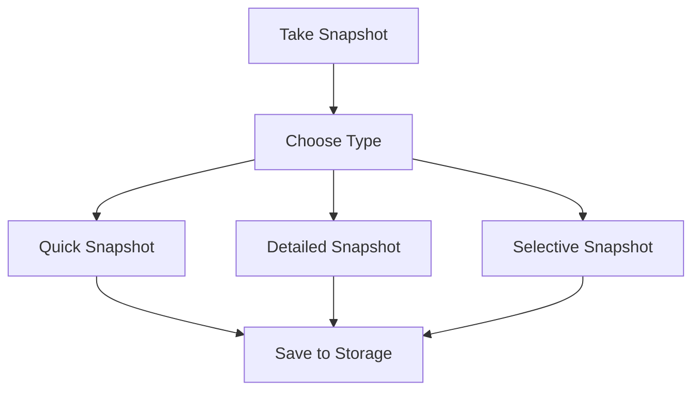

# CodeLapse Documentation Style Guide

This style guide ensures consistency across all CodeLapse documentation, providing clear standards for formatting, structure, and content presentation.

## Table of Contents

- [Document Structure](#document-structure)
- [Heading Hierarchy](#heading-hierarchy)
- [Code Examples](#code-examples)
- [Cross-References](#cross-references)
- [Callouts and Warnings](#callouts-and-warnings)
- [Lists and Tables](#lists-and-tables)
- [File Paths and Commands](#file-paths-and-commands)
- [Visual Elements](#visual-elements)
- [Language and Tone](#language-and-tone)
- [Templates](#templates)

## Document Structure

### Standard Document Layout

All documentation should follow this structure:

```markdown
# Document Title

Brief introduction paragraph explaining the document's purpose and scope.

## Table of Contents (for documents >500 words)

- [Section 1](#section-1)
- [Section 2](#section-2)

## Main Content Sections

### Subsection

Content here...

## Related Documentation

- [Related Doc 1](path/to/doc1.md)
- [Related Doc 2](path/to/doc2.md)
```

### File Naming Conventions

- Use `UPPER_SNAKE_CASE.md` for main documentation files
- Use `kebab-case.md` for supplementary documentation
- Examples: `USER_GUIDE.md`, `API_REFERENCE.md`, `troubleshooting-cli.md`

## Heading Hierarchy

### Heading Levels

```markdown
# H1: Document Title (only one per document)
## H2: Major Sections
### H3: Subsections
#### H4: Sub-subsections (use sparingly)
##### H5: Avoid if possible
###### H6: Never use
```

### Heading Style

- Use sentence case: "Getting started with CodeLapse"
- Not title case: "Getting Started With CodeLapse"
- Be descriptive and specific
- Use parallel structure in related headings

**Good:**
```markdown
## Installing the Extension
## Configuring Settings
## Taking Your First Snapshot
```

**Bad:**
```markdown
## Installation
## Configuration
## First Steps
```

## Code Examples

### Code Block Formatting

Always specify the language for syntax highlighting:

````markdown
```bash
codelapse snapshot create "My changes" --tags "feature"
```

```typescript
interface Snapshot {
  id: string;
  timestamp: number;
  description?: string;
}
```

```json
{
  "success": true,
  "snapshot": {
    "id": "snapshot-123"
  }
}
```
````

### Inline Code

Use backticks for:
- Commands: `codelapse status`
- File names: `package.json`
- Configuration keys: `vscode-snapshots.maxSnapshots`
- Code elements: `takeSnapshot()`

### Command Examples

Format command examples consistently:

```markdown
# Basic command
codelapse snapshot create "Description"

# Command with options
codelapse snapshot create "Description" \
  --tags "feature,wip" \
  --favorite \
  --json --silent

# Multi-step workflow
# Step 1: Create backup
codelapse snapshot create "Backup" --tags "backup"

# Step 2: Make changes
# ... your changes here ...

# Step 3: Create final snapshot
codelapse snapshot create "Final" --favorite
```

### JSON Response Examples

Always show complete, realistic JSON responses:

```json
{
  "success": true,
  "snapshot": {
    "id": "snapshot-1234567890-abc123",
    "description": "Implemented user authentication",
    "timestamp": "2024-01-15T10:30:00.000Z",
    "gitBranch": "feature/auth",
    "gitCommitHash": "a1b2c3d4e5f6",
    "tags": ["feature", "auth"],
    "notes": "Added JWT token validation and user session management",
    "taskReference": "JIRA-123",
    "isFavorite": true,
    "isSelective": false,
    "selectedFiles": []
  },
  "message": "Snapshot 'Implemented user authentication' created successfully"
}
```

## Cross-References

### Internal Links

Use relative paths for internal documentation:

```markdown
See the [User Guide](USER_GUIDE.md) for detailed instructions.
See the [Installation section](USER_GUIDE.md#installation) for setup steps.
```

### External Links

Use descriptive link text:

```markdown
<!-- Good -->
Check the [VS Code Extension API documentation](https://code.visualstudio.com/api) for more details.

<!-- Bad -->
Check [here](https://code.visualstudio.com/api) for more details.
```

### Navigation Aids

Add navigation sections for long documents:

```markdown
## Related Documentation

| Getting Started | Advanced Usage | Development |
|-----------------|----------------|-------------|
| [User Guide](USER_GUIDE.md) | [Git Integration](GIT_COMPANION.md) | [Developer Guide](DEVELOPER_GUIDE.md) |
| [Quick Start](USER_GUIDE.md#quick-start) | [CLI Reference](../cli/README.md) | [Contributing](DEVELOPER_GUIDE.md#contributing) |
```

## Callouts and Warnings

### Warning Types

Use consistent formatting for different warning levels:

#### Critical Security Warnings
```markdown
> ⚠️ **CRITICAL SECURITY WARNING**: 
> - **Data Privacy Risk**: Your code content is transmitted to external AI services
> - **API Key Security**: Third-party services require API keys with potential access implications
> - **Network Exposure**: Code is processed by external providers over the internet
> - **NOT RECOMMENDED** for proprietary, sensitive, or confidential codebases
```

#### Experimental Feature Warnings
```markdown
> ⚠️ **EXPERIMENTAL FEATURE WARNING**: Semantic search is currently experimental with potential risks:
> - **Functionality Changes**: Features may change or be removed without notice
> - **Performance Impact**: May affect extension performance
> - **Use at your own risk** and avoid on sensitive codebases
```

#### General Warnings
```markdown
> ⚠️ **Warning**: This operation cannot be undone. Create a backup snapshot first.
```

#### Information Callouts
```markdown
> 💡 **Tip**: Use descriptive snapshot names to make them easier to find later.

> 📝 **Note**: Snapshots are stored locally and are not shared with your team.

> 🚀 **Pro Tip**: Combine CodeLapse with Git for the ultimate development workflow.
```

### Callout Icons

Use these standard icons consistently:
- ⚠️ Warnings and cautions
- 💡 Tips and helpful information
- 📝 Notes and additional context
- 🚀 Pro tips and advanced techniques
- 🔧 Technical details
- 📚 References to other documentation
- ✅ Success indicators
- ❌ Error indicators
- 🎯 Important points
- 🔍 Search and discovery features

## Lists and Tables

### Unordered Lists

Use consistent bullet formatting:

```markdown
- First item
- Second item
  - Nested item
  - Another nested item
- Third item
```

### Ordered Lists

Use numbers for sequential steps:

```markdown
1. **Install the extension**: Search for "CodeLapse" in VS Code marketplace
2. **Open your project**: Open a folder or workspace in VS Code
3. **Take your first snapshot**: Press `Ctrl+Alt+S` (or `Cmd+Alt+S` on Mac)
4. **View your snapshots**: Click the history icon in the Activity Bar
```

### Tables

Use consistent table formatting:

```markdown
| Feature | CodeLapse | Git | Best Choice |
|---------|-----------|-----|-------------|
| **Quick Experiments** | ✅ One keystroke | ❌ Too formal | **CodeLapse** |
| **Team Collaboration** | ❌ Local only | ✅ Built for sharing | **Git** |
| **Safety Net** | ✅ Zero overhead | ✅ Formal protection | **Both!** |
```

### Configuration Tables

Use consistent formatting for settings:

```markdown
| Setting | Description | Default | Example |
|---------|-------------|---------|---------|
| `vscode-snapshots.maxSnapshots` | Maximum snapshots to keep | `50` | `100` |
| `vscode-snapshots.autoSnapshotInterval` | Auto-snapshot interval (minutes) | `0` | `30` |
```

## File Paths and Commands

### File Paths

Use consistent path formatting:

```markdown
- Absolute paths: `/home/user/project/src/main.ts`
- Relative paths: `src/main.ts`
- Directory paths: `src/` (with trailing slash)
- Configuration paths: `.vscode/settings.json`
```

### Command Line Examples

Format commands consistently:

```markdown
# Single line commands
npm install -g codelapse-cli

# Multi-line commands with continuation
codelapse snapshot create "My changes" \
  --tags "feature,wip" \
  --favorite

# Commands with explanatory comments
# Create a backup before making changes
codelapse snapshot create "Pre-refactor backup" --tags "backup"

# Make your changes here...

# Create final snapshot
codelapse snapshot create "Refactoring complete" --favorite
```

### Keyboard Shortcuts

Format shortcuts consistently:

```markdown
- Windows/Linux: `Ctrl+Alt+S`
- Mac: `Cmd+Alt+S`
- Alternative: `Ctrl+Shift+P` → "Snapshots: Take Snapshot"
```

## Visual Elements

### Screenshots and Diagrams

When describing visual elements:

```markdown


*Figure 1: The Snapshot Explorer displays snapshots grouped by relative time (Today, Yesterday, etc.)*
```

### Mermaid Diagrams

Use Mermaid for architecture and flow diagrams:

````markdown

````

### ASCII Art and Text Diagrams

Use for simple directory structures:

```markdown
.snapshots/
├── index.json
├── snapshot-1234567890-abc123/
│   └── snapshot.json
└── snapshot-1234567891-def456/
    └── snapshot.json
```

## Language and Tone

### Writing Style

- **Active voice**: "Create a snapshot" not "A snapshot should be created"
- **Present tense**: "CodeLapse creates snapshots" not "CodeLapse will create snapshots"
- **Direct and concise**: Avoid unnecessary words
- **User-focused**: Use "you" to address the reader directly

### Technical Terms

Define technical terms on first use:

```markdown
CodeLapse uses **differential storage** (storing only changes between snapshots) to minimize disk usage.
```

### Consistent Terminology

Use these terms consistently:
- **Snapshot** (not "save point" or "checkpoint")
- **Workspace** (not "project" or "folder")
- **Extension** (not "plugin" or "add-on")
- **VS Code** (not "VSCode" or "Visual Studio Code")

## Templates

### New Feature Documentation Template

```markdown
# Feature Name

Brief description of what this feature does and why it's useful.

## Overview

Detailed explanation of the feature's purpose and benefits.

## Getting Started

### Prerequisites

- List any requirements
- Include version numbers where relevant

### Basic Usage

1. **Step 1**: Detailed first step
2. **Step 2**: Detailed second step
3. **Step 3**: Detailed third step

### Example

```bash
# Example command or code
codelapse feature-command --option value
```

## Advanced Usage

### Configuration

| Setting | Description | Default |
|---------|-------------|---------|
| `setting.name` | What it does | `default` |

### Integration Examples

Show how this feature works with other parts of CodeLapse.

## Troubleshooting

### Common Issues

#### Issue: Problem description
**Symptoms**: What the user sees
**Solution**: How to fix it

## Related Documentation

- [Related Feature 1](link1.md)
- [Related Feature 2](link2.md)
```

### API Documentation Template

```markdown
# API Method Name

Brief description of what this API method does.

## Syntax

```typescript
methodName(parameter1: Type, parameter2?: OptionalType): ReturnType
```

## Parameters

| Parameter | Type | Required | Description |
|-----------|------|----------|-------------|
| `parameter1` | `Type` | Yes | What this parameter does |
| `parameter2` | `OptionalType` | No | What this optional parameter does |

## Return Value

Returns a `ReturnType` object with the following properties:

```typescript
interface ReturnType {
  success: boolean;
  data?: DataType;
  error?: string;
}
```

## Examples

### Basic Usage

```typescript
const result = await methodName("value1");
if (result.success) {
  console.log("Success:", result.data);
} else {
  console.error("Error:", result.error);
}
```

### Advanced Usage

```typescript
const result = await methodName("value1", { option: true });
// Handle result...
```

## Error Handling

Common errors and how to handle them:

| Error Code | Description | Solution |
|------------|-------------|----------|
| `ERROR_CODE` | What causes this error | How to fix it |

## Related Methods

- [Related Method 1](method1.md)
- [Related Method 2](method2.md)
```

### Troubleshooting Entry Template

```markdown
## Issue: Brief Problem Description

**Symptoms**: 
- What the user experiences
- Error messages they see
- Behavior they observe

**Causes**:
- Common cause 1
- Common cause 2

**Solutions**:

1. **First Solution** (most common):
   ```bash
   command-to-run --with-options
   ```
   Expected result: What should happen

2. **Alternative Solution**:
   ```bash
   alternative-command
   ```
   When to use: Specific circumstances

3. **Advanced Solution**:
   More complex steps for edge cases

**Prevention**:
How to avoid this issue in the future

**Related Issues**:
- [Similar Issue 1](#similar-issue-1)
- [Similar Issue 2](#similar-issue-2)
```

---

## Style Checklist

Before publishing documentation, verify:

- [ ] Document follows standard structure
- [ ] Headings use proper hierarchy and sentence case
- [ ] Code blocks specify language for syntax highlighting
- [ ] Commands are formatted consistently
- [ ] JSON examples are complete and realistic
- [ ] Cross-references use relative paths
- [ ] Warnings use appropriate icons and formatting
- [ ] Tables are properly formatted
- [ ] File paths and shortcuts are consistent
- [ ] Language is active, present tense, and user-focused
- [ ] Technical terms are defined on first use
- [ ] All links work correctly
- [ ] Content is proofread for grammar and spelling

---

This style guide should be referenced when creating or updating any CodeLapse documentation to ensure consistency and quality across all materials.